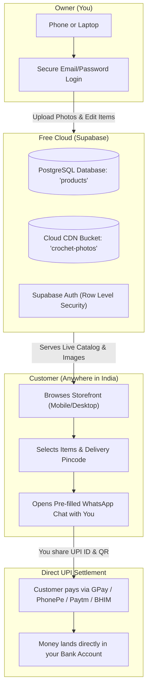

# 🌸 Cute Little Crochet — Complete Project & Store Handbook

A complete reference guide documenting the design, technical architecture, cloud setup, order workflow, security details, and deployment steps for **Cute Little Crochet**.

---

## 📌 1. Project Overview & Business Strategy

| Attribute | Details |
| :--- | :--- |
| **Business Name** | **Cute Little Crochet** |
| **Live Website URL** | **[https://cutelittlecrochet.netlify.app/](https://cutelittlecrochet.netlify.app/)** 🌐 |
| **Location / Market** | India (Domestic shipping pan-India) |
| **Currency** | Indian Rupee (**₹ INR**) |
| **Ordering Model** | **WhatsApp & UPI Commerce** (Direct chat + UPI payments via GPay, PhonePe, Paytm, BHIM) |
| **Cloud Backend** | **Supabase** (Free Tier: PostgreSQL Database, Cloud Photo Storage, Email/Password Auth) |
| **Hosting Platform** | **Netlify** (100% Free Tier with global SSL & CDN) |
| **Project Folder** | `C:\Users\jofra\.gemini\antigravity\scratch\cute-little-crochet\` |

### Why This Architecture Was Chosen
- **No Cost:** Zero monthly platform subscriptions (unlike Shopify at \$29-\$39/month).
- **No Gateway Commission or KYC:** Avoids payment gateway setup fees, merchant registration, and transaction commissions (usually 2-3%).
- **High Conversion for Handmade Items:** In India, forcing customer account signups causes massive cart abandonment. Indian shoppers prefer chatting directly on WhatsApp to ask about colors, sizing, and delivery timelines before paying via UPI.
- **Centralized Live Catalog:** Backed by Supabase, so when you add or edit a product from your phone or laptop, every customer across India sees the change immediately.

---

## 🏗️ 2. System Architecture



---

## 📂 3. Project File Structure

All files are located in `C:\Users\jofra\.gemini\antigravity\scratch\cute-little-crochet\`:

```text
cute-little-crochet/
├── index.html               # Main website storefront & owner dashboard modal
├── app.js                   # Application logic, Supabase sync, cart, WhatsApp formatter
├── config.js                # Configuration file for Supabase URL & Anon Key
├── setup_supabase.sql       # 1-click database, storage bucket, and security setup script
├── README.md                # Quick-start instructions
└── PROJECT_DOCUMENTATION.md # This comprehensive handbook
```

### Detailed File Responsibilities:
1. **[index.html](file:///C:/Users/jofra/.gemini/antigravity/scratch/cute-little-crochet/index.html):**
   - Single-page responsive web app styled with modern Tailwind CSS and Lucide icons.
   - **Hero Section:** Friendly introduction with trust badges (100% Handcrafted, Pan-India Delivery, Easy UPI).
   - **Category Pills:** Filter by *All Pieces*, *Plushies & Amigurumi*, *Bags & Totes*, *Wearables & Hats*, *Hair Accessories*, and *Home & Coasters*.
   - **Product Badges:** Dynamic tags (*Ready to Ship*, *Made to Order (3-5 days)*, *Sold Out*).
   - **Shopping Bag Drawer:** Slide-out cart displaying subtotal, customer name, delivery pincode, custom gift note, and the primary "Place Order on WhatsApp" button.
   - **Product Detail Modal:** Displays large high-res photo, dimensions, yarn composition (100% milk cotton), and wash care instructions.
   - **Owner Dashboard Modal:** Password/Email protected portal to add, edit, and delete products, toggle stock status, and update shop contact details.

2. **[app.js](file:///C:/Users/jofra/.gemini/antigravity/scratch/cute-little-crochet/app.js):**
   - Connects to Supabase client using `@supabase/supabase-js`.
   - Fetches live products from the Supabase `products` table on load.
   - Handles photo uploads to the Supabase `crochet-photos` storage bucket.
   - Formats clean WhatsApp order messages with item lists, prices in ₹, pincodes, and totals.
   - Includes graceful fallback: operates in "Demo Mode" if Supabase is disconnected so the site is never broken.

3. **[config.js](file:///C:/Users/jofra/.gemini/antigravity/scratch/cute-little-crochet/config.js):**
   - Keeps your `SUPABASE_URL` and `SUPABASE_ANON_KEY` organized in one place.

4. **[setup_supabase.sql](file:///C:/Users/jofra/.gemini/antigravity/scratch/cute-little-crochet/setup_supabase.sql):**
   - Ready-to-run SQL script that creates tables, configures public/owner security policies (RLS), sets up the photo storage bucket, and pre-populates the 8 starter creations.

---

## 🔒 4. Security & Privacy Breakdown

| Question | Answer & Security Mechanism |
| :--- | :--- |
| **Can customers see my bank passwords or private info?** | **No.** You never enter bank passwords, ATM PINs, or OTPs on this site. |
| **Is my WhatsApp number private?** | It is public in the WhatsApp link so customers can chat with you. *(Best Practice: Use a secondary WhatsApp Business SIM instead of your personal number).* |
| **Is my UPI ID private?** | It is displayed so customers can pay you. A UPI ID (e.g. `yourshop@okhdfcbank`) can **only receive funds**, never withdraw. *(Note: Banking apps like GPay display the name registered on that account when looked up).* |
| **Can a stranger hack or delete my catalog?** | **No.** Supabase uses **Row Level Security (RLS)**. Anonymous visitors are restricted strictly to `SELECT` (read-only). Only your authenticated owner login has permission to `INSERT`, `UPDATE`, or `DELETE`. |
| **Where are product photos stored?** | In the public `crochet-photos` bucket on Supabase's global Content Delivery Network (CDN) for fast loading. |

---

## ⚙️ 5. Step-by-Step Supabase Cloud Setup Guide

If you ever need to set up Supabase again or connect a new database:

### Step 1: Create Project
1. Log in to [supabase.com](https://supabase.com).
2. Click **"New Project"**, name it `cute-little-crochet`, and choose region **South Asia (Mumbai)**.

### Step 2: Run Database Setup
1. In the Supabase left sidebar, click **SQL Editor** (the `>_` terminal icon).
2. Click **"New query"**.
3. Paste the contents of `setup_supabase.sql` and click **"Run"**.
   - *This creates the `products` table, security rules (RLS), and the `crochet-photos` storage bucket.*

### Step 3: Create Your Owner Account
1. In the Supabase left sidebar, click **Authentication** (two people icon `👥`) $\rightarrow$ **Users**.
2. Click **"Add user"** $\rightarrow$ **"Create user"**.
3. Enter your email and password.
4. Toggle **"Auto Confirm User?"** to **ON**, then click **"Create user"**.

### Step 4: Get API Credentials
1. Click the **Gear icon ⚙️** at the very bottom of the sidebar $\rightarrow$ **API** (or **Data API**).
2. Copy the **Project URL** (`https://xyz.supabase.co`).
3. Copy the **anon public key** (`eyJ...`).
4. In your website, open **Owner Dashboard** $\rightarrow$ **Shop Settings**, paste them in, and click **"Save & Connect Cloud DB"**.

---

## 🛍️ 6. How the Order & Payment Flow Works

```text
Customer browses catalog 
   └── Adds "Daisy Meadow Tote Bag (₹1,199)" to bag
   └── Clicks "Place Order on WhatsApp"
         │
         ▼
WhatsApp chat opens with you automatically:
   🌸 Cute Little Crochet - New Order Request 🌸
   -----------------------------------------
   👤 Name: Priya
   📍 Delivery Pincode: 560038
   🛍️ Order Summary:
   • 1x Daisy Meadow Slouchy Tote Bag - ₹1,199
   💰 Subtotal: ₹1,199
   -----------------------------------------
         │
         ▼
You reply on WhatsApp:
   "Hi Priya! Your tote bag is ready in stock. 
    Shipping to pincode 560038 is ₹60. Total: ₹1,259.
    Please pay via UPI to: cutelittlecrochet@okhdfcbank
    and send a screenshot once done!"
         │
         ▼
Customer pays on GPay / PhonePe / Paytm & sends screenshot
         │
         ▼
You pack the creation and ship via India Post / Delhivery!
```

---

## 🛠️ 7. How to Manage Your Store Daily

### How to Open the Site Locally:
- Double-click `index.html` inside `C:\Users\jofra\.gemini\antigravity\scratch\cute-little-crochet\`.
- Bookmark it in Chrome/Edge (`Ctrl + D`) for fast access.

### How to Access the Private Owner Admin Portal:
- Navigate to your secret link: **`https://cutelittlecrochet.netlify.app/?admin=true`** (Bookmark this on your phone/laptop!).
- *Or backup shortcut:* Tap or click 3 times rapidly on the **🌸 logo** in the header.
- Log in with your Owner Email and Password.

### How to Add a New Creation:
1. Open the Admin Portal via `?admin=true`.
3. Go to the **"Add New Creation"** tab.
4. Click **Choose File** to pick a photo from your phone or computer.
5. Enter title, category, price in ₹, and description.
6. Click **"Publish to Storefront"** — the photo uploads to Supabase Storage and appears on your site immediately!

### How to Edit an Item:
1. In the Owner Dashboard, go to **"Manage Catalog"**.
2. Click **"Edit"** on any product row.
3. Update the price, discount, or select a new replacement photo.
4. Click **"Save Changes"**.

### How to Mark an Item "Sold Out":
- In **"Manage Catalog"**, click the **"Mark Sold"** button. The item's badge changes to *Sold Out* on the storefront and disables the "Add to Bag" button.

---

## 🚀 8. Website Deployment & Live Status

Your store is officially live on the internet! 

- **Live URL:** **[https://cutelittlecrochet.netlify.app/](https://cutelittlecrochet.netlify.app/)**
- **Hosting Provider:** Netlify (Free Tier with automated SSL/HTTPS and global CDN)
- **Deployment Method:** Netlify Drop

### How to Deploy Future Updates:
Whenever you make updates to your files (e.g. adding new features or adjusting styles):
1. Go to **[app.netlify.com](https://app.netlify.com)** $\rightarrow$ click your `cutelittlecrochet` site.
2. Go to the **Deploys** tab.
3. Drag and drop the updated `cute-little-crochet` folder into the drop area at the bottom. It updates live within seconds!

### Adding a Custom Domain (Later):
- Buy a `.in` or `.com` domain (e.g. from Namecheap, Porkbun, or Cloudflare Registrar for ~₹600–₹800/year).
- In Netlify, go to **Domain management** $\rightarrow$ **Add custom domain** $\rightarrow$ type `cutelittlecrochet.in` and follow the 1-step DNS guide.

---

## 📈 9. Future Roadmap & Scaling

When your orders scale up and you want further automation:
1. **Automated Payment Gateway:** You can sign up for **Razorpay** or **Cashfree** with your Indian business bank account to accept automated card payments and instant UPI intents on the site.
2. **Automated Shipping Integration:** You can integrate with shipping aggregators like **Shiprocket** or **Pickrr** to automatically generate shipping labels and courier pickups across India.
3. **Instagram Shopping:** Connect your catalog to Meta Commerce Manager to tag your crochet products directly in Instagram posts and reels.

---

*Crafted with ♥ for Cute Little Crochet — September 2026*
